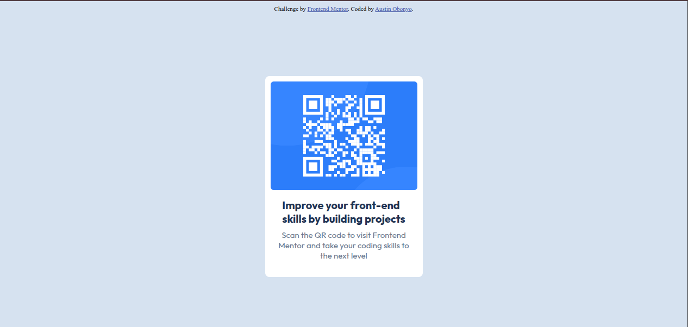
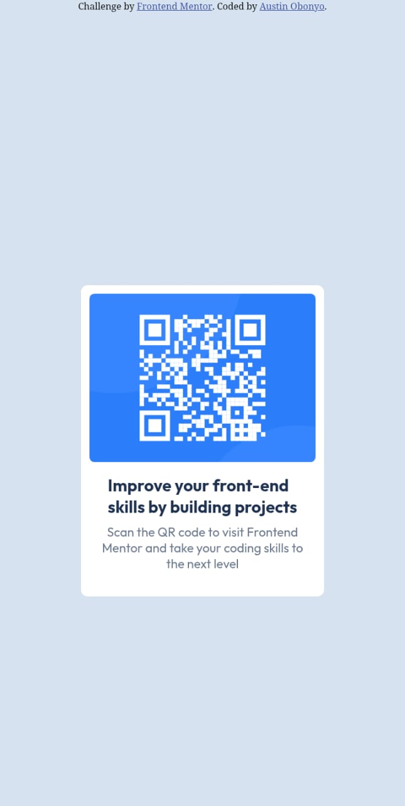

# Frontend Mentor - QR code component solution

This is a solution to the [QR code component challenge on Frontend Mentor](https://www.frontendmentor.io/challenges/qr-code-component-iux_sIO_H). Frontend Mentor challenges help you improve your coding skills by building realistic projects.

## Screenshots

  
  

## 🔗 Links

- [Solution URL:](https://www.frontendmentor.io/solutions/responsive-qr-code-card-using-css-flexbox-741lzHKwzA)
- [Live Site URL:](https://responsive-qr-code-card-using-css-flexbox.vercel.app/)

## Built with

- Semantic HTML5 markup
- CSS custom properties
- Flexbox
- CSS Grid
- Desktop-first workflow

## What I learned

- How to center content vertically and horizontally using Flexbox and `100vh`
- Improved my ability to translate design files into clean, pixel-perfect code

## Continued development

In future projects, I want to focus on:

- Writing cleaner and more maintainable CSS
- Getting better at pixel-perfect implementation from design tools like Figma

## Useful resources

- [w3schools](https://www.w3schools.com/cssref/index.php) - Helped me understand `object-fit`, `viewport units`, and more.

## Authors

- GitHub - [@Austinjnr](https://github.com/Austinjnr)
- Website - [Austin Obonyo](https://austinobonyo.vercel.app/)
- Frontend Mentor - [@Austinjnr](https://www.frontendmentor.io/profile/Austinjnr)
- Twitter/X - [@AustinWalkker](https://x.com/AustinWalkker)
